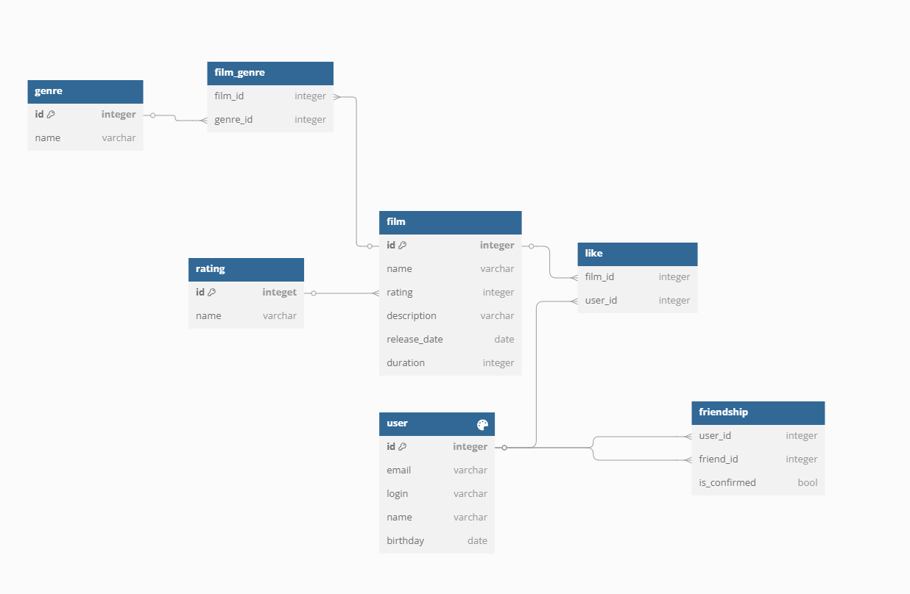

### Схема БД

### film

Таблица с фильмами

| Поле         | Тип                         | Описание                                             |
| ------------ | --------------------------- | ---------------------------------------------------- |
| id           | integer not null, pk        | Уникальный идентификатор                             |
| name         | varchar not null            | Название                                             |
| rating       | integer not null, fk rating | Возрастной рейтинг, ссылка на поле id таблицы rating |
| description  | nvarchar(256)               | Описание                                             |
| release_date | date                        | Дата выхода                                          |
| duration     | integer                     | Длительность                                         |

### user

Таблица с пользователями

| Поле     | Тип                  | Описание                 |
| -------- | -------------------- | ------------------------ |
| id       | integer not null, pk | Уникальный идентификатор |
| email    | varchar not null     | Электронная почта        |
| login    | varchar not null     | Логин                    |
| name     | nvarchar(128)        | Имя                      |
| birthday | date                 | Дата рождения            |

### genre

Таблица с жанрами

| Поле | Тип                  | Описание                 |
| ---- | -------------------- | ------------------------ |
| id   | integer not null, pk | Уникальный идентификатор |
| name | varchar not null     | Наименование             |

### film_genre

Связь фильма и жанра

| Поле     | Тип                        | Описание                              |
| -------- | -------------------------- | ------------------------------------- |
| film_id  | integer not null, fk film  | Фильм, ссылка на поле id таблицы film |
| genre_id | integer not null, fk genre | Жанр, ссылка на поле id таблицы genre |

### rating

Таблица с возрастными рейтингами

| Поле | Тип                  | Описание                 |
| ---- | -------------------- | ------------------------ |
| id   | integer not null, pk | Уникальный идентификатор |
| name | varchar not null     | Наименование             |

### like

Таблица с лайками фильмов

| Поле    | Тип                       | Описание                                     |
| ------- | ------------------------- | -------------------------------------------- |
| film_id | integer not null, fk film | Фильм, ссылка на поле id таблицы film        |
| user_id | integer not null, fk user | Пользователь, ссылка на поле id таблицы user |

### friendship

Таблица с информацией о дружбе

| Поле         | Тип                       | Описание                                     |
| ------------ | ------------------------- | -------------------------------------------- |
| user_id      | integer not null, fk user | Пользователь, ссылка на поле id таблицы user |
| friend_id    | integer not null, fk user | Пользователь, ссылка на поле id таблицы user |
| is_confirmed | boolean                   | Признак подтверждения                        |

